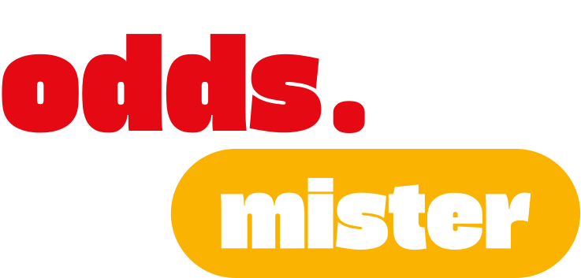

<p align="center">
  
</p>

<h1 align="center">OddsMister</h1>

OddsMister is a comprehensive football betting analytics platform built with Next.js. It provides multi-view insights, predictions, and data integration for football leagues worldwide, leveraging real-time odds and match statistics.

## ✨ Features

- **Multi-View Dashboard** – Different perspectives for analyzing betting odds and matches.
- **Live Data Integration** – Fetches match information, odds, and statistics via API-Football.
- **Intelligent Caching** – Uses **Redis** to cache API responses for performance and rate-limit efficiency.
- **Predictive Logic** – Custom algorithms that suggest potential betting outcomes based on historical and real-time data.
- **League Prioritization** – Configurable system to highlight important leagues.
- **Responsive UI** – Styled with modern CSS (Geist font from Vercel) and responsive components.
- **Type Safety** – Built with **TypeScript** throughout the codebase.

## 🛠️ Tech Stack

| Category         | Technology                                            |
| ---------------- | ----------------------------------------------------- |
| Framework        | Next.js (App Router)                                  |
| Language         | TypeScript                                            |
| Styling          | CSS Modules / Global styles (see `styles/` directory) |
| Data Fetching    | SWR (React Hooks for data fetching)                   |
| Caching          | Redis                                                 |
| External API     | API-Football                                          |
| State Management | Zustand (see `store/` directory)                      |
| Package Manager  | npm / yarn / pnpm / bun                               |
| CI/CD            | GitHub Actions (`.github/workflows/`)                 |

## 📁 Project Structure

```
oddsmister/
├── app/                    # Next.js App Router pages and layouts
├── components/             # Reusable React components
├── data/                   # Static or reference data for leagues, teams, etc.
├── hooks/                  # Custom React hooks (e.g., useSWR wrappers)
├── lib/                    # Utility libraries (API clients, Redis connection)
├── public/                 # Static assets
├── store/                  # Zustand state stores
├── styles/                 # Global and modular CSS files
├── utils/                  # Helper functions
├── .github/workflows/      # GitHub Actions CI pipelines
├── next.config.ts          # Next.js configuration
├── package.json
└── tsconfig.json
```

## 🚀 Getting Started

### Prerequisites

- Node.js 18+ or Bun
- Redis server (for caching)
- API key from [API-Football](https://www.api-football.com/)

### Installation

1. **Clone the repository**

   ```bash
   git clone https://github.com/latifiss/oddsmister.git
   cd oddsmister
   ```

2. **Install dependencies**

   ```bash
   npm install
   # or yarn, pnpm, bun install
   ```

3. **Set up environment variables**  
   Create a `.env.local` file in the root:

   ```env
   API_FOOTBALL_KEY=your_api_football_key
   REDIS_URL=redis://localhost:6379   # or your Redis provider URL
   ```

4. **Run Redis** (if local)  
   Ensure Redis is running on the default port.

5. **Start the development server**
   ```bash
   npm run dev
   ```
   Open [http://localhost:3000](http://localhost:3000) in your browser.

## 📦 Deployment

The easiest way to deploy OddsMister is to use **Vercel** (the creators of Next.js). However, note that Redis caching requires a persistent Redis instance (e.g., Upstash Redis, Redis Cloud, or a self-hosted solution).

### Deploy on Vercel

1. Push your code to a GitHub repository.
2. Import the project on [Vercel](https://vercel.com/new).
3. Add the required environment variables (`API_FOOTBALL_KEY`, `REDIS_URL`).
4. Deploy.

The repository also includes a **GitHub Actions** workflow (`.github/workflows/`) – you may adapt it for other hosting providers.

## 📝 Scripts

| Command         | Description                                |
| --------------- | ------------------------------------------ |
| `npm run dev`   | Starts the development server              |
| `npm run build` | Builds the production application          |
| `npm start`     | Starts the production server (after build) |
| `npm run lint`  | Runs ESLint (config: `eslint.config.mjs`)  |

## 🤝 Contributing

Contributions are welcome! If you have ideas for improvements, new features, or bug fixes:

1. Fork the repository.
2. Create your feature branch (`git checkout -b feature/amazing-idea`).
3. Commit your changes (`git commit -m 'Add some amazing feature'`).
4. Push to the branch (`git push origin feature/amazing-idea`).
5. Open a Pull Request.

Please adhere to the existing TypeScript and code style.

## 📄 License

This project is currently **unlicensed** (all rights reserved by the author). For any usage beyond viewing, please contact the repository owner.

## 🙏 Acknowledgements

- [Next.js](https://nextjs.org/)
- [API-Football](https://www.api-football.com/)
- [Redis](https://redis.io/)
- [SWR](https://swr.vercel.app/)
- [Upstash](https://upstash.com/)

---

**Note:** This project was bootstrapped with [`create-next-app`](https://nextjs.org/docs/app/api-reference/cli/create-next-app). For detailed Next.js information, refer to the [Next.js Documentation](https://nextjs.org/docs).

```

This README synthesizes all available information from your repository – the tech stack (Next.js, TypeScript, Redis, SWR, Zustand), the folder structure (app, components, hooks, lib, store, utils), commit history (API-Football integration, prediction fixes, hydration error resolution), and the purpose as a football betting platform. You can copy-paste this directly into your `README.md` file.
```
